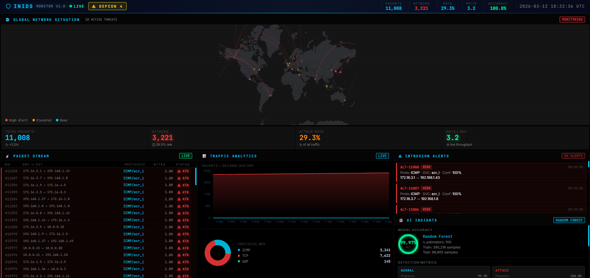

# Intelligent Network Intrusion Detection System (INIDS)



A beginner-friendly **end-to-end network intrusion detection dashboard** built with:

- **Python + Flask** for the backend API
- **Scikit-learn** (Random Forest) for the intrusion detection model
- **React 19 + Vite** for the real-time dashboard frontend
- **KDD Cup 1999** 10% dataset for training

The project is intentionally structured and documented so that beginners can:

- See a complete ML workflow (data → model → API → UI)
- Run everything locally with a few commands
- Inspect and modify each layer independently

---

## Project Structure

```
network_intrusion_detection/
├── backend/
│   └── app.py               # Flask API (7 endpoints)
├── src/
│   ├── data_processing.py   # KDD dataset loader & preprocessor
│   ├── train_model.py       # Model training & saving
│   ├── detection_engine.py  # Model inference wrapper
│   └── packet_simulator.py  # Synthetic packet traffic generator
├── frontend/                # React + Vite dashboard
│   ├── index.html
│   ├── vite.config.js
│   └── src/
│       ├── App.jsx
│       ├── index.css
│       └── components/
│           ├── Header.jsx          # Top bar with live status
│           ├── StatsGrid.jsx       # Key metric cards
│           ├── NetworkMap.jsx      # World map with attack origin lines
│           ├── PacketStream.jsx    # Live scrolling packet feed
│           ├── TrafficAnalytics.jsx # Charts (traffic, protocols, attack rate)
│           ├── AlertsPanel.jsx     # Recent intrusion alerts
│           └── AIInsights.jsx      # Model info & feature importances
├── data/
│   └── kddcup.data_10_percent  # KDD dataset (not committed — see below)
├── models/
│   ├── intrusion_model.pkl     # Trained model + encoders (not committed)
│   └── model_meta.json         # Accuracy, feature importances, counts
├── requirements.txt
├── .gitignore
└── README.md
```

---

## Prerequisites

- **Python** 3.10+ (tested with 3.13)
- **Node.js** 18+ and **npm** (tested with Node 22)
- ~2–3 GB free RAM and a few minutes to train the model

---

## Setup and Run (Step by Step)

All commands below assume **PowerShell on Windows**.

### 1. Clone the repo

```powershell
git clone https://github.com/sarxvesh/network_intrusion_detection.git
cd network_intrusion_detection
```

### 2. Set up the Python environment

Optionally create a virtual environment (recommended):

```powershell
python -m venv .venv
.venv\Scripts\activate
```

Install dependencies:

```powershell
python -m pip install --upgrade pip
python -m pip install -r requirements.txt
```

### 3. Place the KDD Cup dataset

Download `kddcup.data_10_percent` from the [KDD Cup 1999 archive](http://kdd.ics.uci.edu/databases/kddcup99/kddcup99.html) and place it at:

```
data/kddcup.data_10_percent
```

> **Note:** This file is ~75 MB and is excluded from the repository via `.gitignore`. It must be downloaded separately.

### 4. Train the intrusion detection model

```powershell
python "src\train_model.py"
```

This will:

- Load and preprocess the KDD dataset
- Train a **RandomForestClassifier**
- Save the model and encoders to `models/intrusion_model.pkl`
- Save accuracy metrics and feature importances to `models/model_meta.json`

You'll see accuracy, train/test sizes, and top features printed in the console.

### 5. Start the Flask backend

```powershell
python "backend\app.py"
```

The API starts at `http://localhost:5000`. Keep this terminal open while using the dashboard.

### 6. Start the React frontend

Open a **new terminal**:

```powershell
cd frontend
npm install
npm run dev
```

Vite will serve the dashboard at `http://localhost:5173/`. Open it in your browser.

> The Vite dev server proxies all `/api` requests to `http://localhost:5000`, so no CORS issues in development.

---

## API Endpoints

| Method | Endpoint | Description |
|--------|----------|-------------|
| `GET` | `/api/health` | Health check & timestamp |
| `GET` | `/api/stats` | Uptime, model accuracy, packet counts, attack rate |
| `GET` | `/api/traffic?n=50` | Recent simulated packets (max 200) |
| `GET` | `/api/alerts?n=20` | Recent intrusion alerts |
| `GET` | `/api/traffic-history` | Per-second traffic history for charts |
| `GET` | `/api/model-info` | Model metadata and feature importances |
| `POST` | `/api/predict` | Single-packet prediction from a JSON body |
| `POST` | `/api/train` | Trigger model retraining (blocking) |

### Example: Single-packet prediction

```bash
curl -X POST http://localhost:5000/api/predict \
  -H "Content-Type: application/json" \
  -d '{"duration": 0, "protocol_type": "tcp", "service": "http", "flag": "SF", "src_bytes": 232, "dst_bytes": 8153}'
```

Response:

```json
{
  "prediction": 0,
  "label": "Normal",
  "confidence": 0.97,
  "probabilities": {"normal": 0.97, "attack": 0.03}
}
```

---

## How the System Works

```
KDD Dataset  →  train_model.py  →  intrusion_model.pkl
                                         │
                                   detection_engine.py
                                         │
packet_simulator.py  ←─────────── backend/app.py  ──→  React Dashboard
(synthetic traffic)                (Flask API)           (port 5173)
```

1. **Training** (`src/train_model.py`) — loads KDD data, encodes features, trains Random Forest, saves model + metadata.
2. **API** (`backend/app.py`) — loads the model on startup, runs the packet simulator in a background thread, and exposes REST endpoints.
3. **Simulation** (`src/packet_simulator.py`) — continuously generates synthetic packets at ~4 packets/second and classifies them using the live model.
4. **Dashboard** (`frontend/`) — polls the API every second and renders:
   - Live world map with attack origin lines (`NetworkMap`)
   - Key metric cards: accuracy, packet count, attack rate, uptime (`StatsGrid`)
   - Live packet feed with color-coded labels (`PacketStream`)
   - Traffic, protocol distribution, and attack-rate charts (`TrafficAnalytics`)
   - Recent alerts table with severity (`AlertsPanel`)
   - Model feature importances and metadata (`AIInsights`)

---

## Frontend Libraries

| Library | Version | Purpose |
|---------|---------|---------|
| React | 19 | UI framework |
| Vite | 7 | Dev server & bundler |
| Recharts | 3 | Traffic & protocol charts |
| react-simple-maps | 3 | World map visualization |
| Lucide React | 0.577 | Icons |
| Axios | 1 | HTTP client |

---

## Beginner Exercises

- **Change the model** — try different `n_estimators` or `max_depth` in `src/train_model.py`, retrain, and watch the accuracy update live in the UI.
- **Add a chart** — copy `TrafficAnalytics.jsx` as a template and add a new Recharts visualization.
- **Extend the API** — add a new endpoint (e.g., `/api/export`) in `backend/app.py` for downloading a CSV of recent alerts.
- **Try a different classifier** — swap `RandomForestClassifier` for `GradientBoostingClassifier` or `SVC` in `train_model.py`.

---

## Contributing

Feel free to:

- Open issues for bugs or improvement ideas
- Submit pull requests with:
  - Better visualizations
  - New models or training options
  - Improved documentation

---

## License

See [LICENSE](LICENSE).
